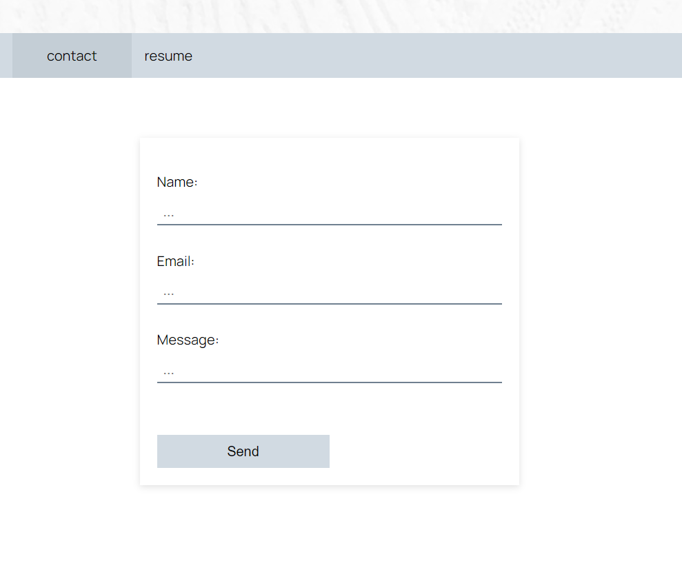

# pwa-text-editor

  
 


## Description 

This project utilizes ReactJS to create a single-page application with conditional rendering. Interactive elements include navigation, forms, and downloadables. This is a project I intend on improving over time.

## User Story

```md
AS AN employer looking for candidates with experience building single-page applications
I WANT to view a potential employee's deployed React portfolio of work samples
SO THAT I can assess whether they're a good candidate for an open position
```

## Table of Contents 
* [Screenshots](#screenshots)
* [Deployed App](#deployed-app)
* [Credits](#credits)
* [License](#license)
* [Questions](#questions)

## Screenshots
<br>



<br>

## Deployed App

https://vlad-kronk.github.io/react-portfolio/

## Credits

- Henry & Co. for white painted wall image
- Mikhail Sharanda for Manrope font
- Kimberly Geswein for Indie Flower font
- AvatarMaker.com for avatar
## License

MIT License

---

## Questions?

Reach out with any questions!

GitHub: [vlad-kronk](https://github.com/vlad-kronk)

[](https://www.linkedin.com/in/jmeyers6/)
